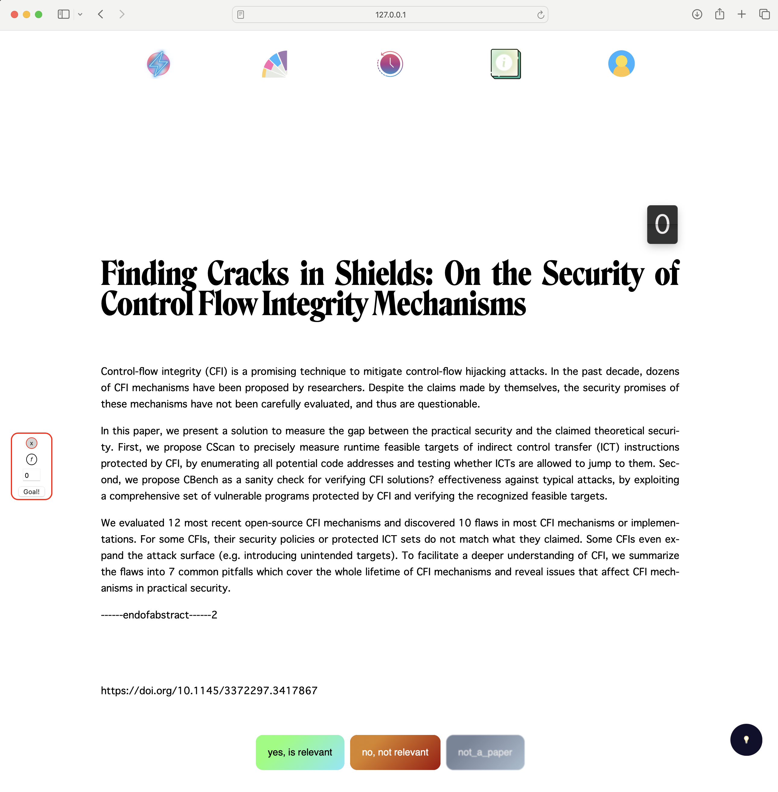

<p align="center"></p>


 [](https://opensource.org/licenses/MIT) [](https://joss.theoj.org/papers/d58ad58b740d1d2d2470beaf533ef221) 

[](https://nathanreitinger.github.io/CART/)


# Culling Abstracts for Relevancy in Teams

`CART` provides a way for teams of researchers to "cull" through a large set of papers when conducting a systematic review—also known as an "SoK." `CART` uses `ngrok` (a free service for temporary website creation), to zero-step the startup time for collaborative relevancy checking—you may also run the service locally on localhost for testing or point a server at the service. 

### Documentation

Documentation for `CART` is available on [Read the Docs](https://nathanreitinger.github.io/CART/).

### Motivation

Let's assume you just started a new SoK project, [like this one](https://conpro23.ieee-security.org/papers/reitinger-conpro23.pdf). The first step in the project will be to review conference publications from the past *n* years to determine if each paper is relevant to your SoK's particular topic. So you'd have a larger number of papers to review (something like *n=10,000*), and you will likely only be reading the titles and abstracts of these papers to determine relevancy; you also likely want one or more team members to review each paper (to get a less biased relevancy determination or split the work up). What you need is a way to review a large number of paper titles and abstracts, "vote" on the relevancy of each paper, and have a system to keep track of your votes. 


Enter `CART`: a system for voting on a large number of abstracts in teams.

### Functionality

`CART` allows teams of researchers to collaboratively vote on abstracts via `ngrok` (a [unified ingress platform 
for developers](https://ngrok.com/)), providing an ephemeral or static (flags in `CART`) website for researchers to conduct their relevancy checks. The program is simple to setup with anaconda:

```
git clone https://github.com/nathanReitinger/CART
cd CART
--UNIX: conda env create -f cart.yml 
--WINDOWS: conda env create -f cart-windows.yml
conda activate cart
python3 cart.py -c user1 -c user2 <== two users, using localhost
```

`CART` places an emphasis on interpretability in coding. Information for each paper being voted on is stored in the `/abstracts/` folder; these files can easily be inspected with a text editor, as opposed to a more formal database. 

### Architecture (in brief)

`CART` uses the Flask framework, and serves a variety of pages:


- **Home**: where users vote on abstracts
- **Progress**: how many papers have been voted on 
- **History**: your votes per paper (allows you to change a vote as well)
- **About**: information about your project (editable by team members)
- **Account**: login and logout information 

The primary `cart.py` program serves all web pages and updates abstracts located in the `abstracts` folder. Abstracts must follow an internal convention (more detail [here](https://nathanreitinger.github.io/CART/assumptions/)). `CART` also provides a variety of gamifications to make the coding process easier (e.g., confetti on every *n*<sup>th</sup> abstract voted on). 

### Contributing

See our contributing [guidelines](https://nathanreitinger.github.io/CART/CONTRIBUTING/), we'd love the help!

### DEMO 



### Repo Structure 

```
.
├── LICENSE.txt
├── README.md
├── abstracts                  // papers as <ID>.csv go here
│   ├── -example_data_big      // example papers (many of them!)
│   │   ├── 1.csv              // formatted as <ID>.csv (ID like primary key)
│   │   ├── ...								
│   │   └── 99.csv							
│   ├── -example_data_small    // example papers (few of them!)
│   │   ├── 1.csv
│   │   ├── ...
│   │   └── 5.csv
│   ├── -sample_from_scrape/   // folder output for get_data.py 
│   └── -testing               // folder used by test.py to run tests
├── cart.py                    // *************** main program *************** // 
├── docs/                      // documentation for readthedocs
├── info/                      // "about" tab for information on relevancy assessment
├── mkdocs.yml                 // readthedocs
├── paper/                     // JOSS
├── requirements.txt           // install dependencies 
├── sample_get_data/get_data.py// web scraper to populate sample paper data 
├── static/                    // images and CSS for web
├── templates                  // web page HTML files
│   ├── history.html           // past n abstracts you voted on (can change vote)
│   ├── index.html             // home (gamified voting experience)
│   ├── info.html              // "about" page editable by team members
│   ├── progress.html          // total votes cast and who cast them
│   └── start.html             // "account" page for login and logout 
└── testing/test.py            // testing scripts for `CART` app 

```


