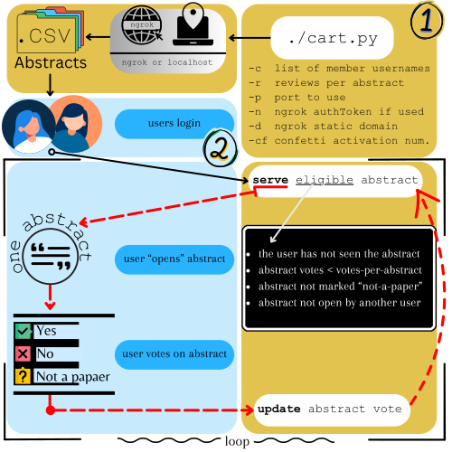

# Architecture

The following figure provides a high-level overview of`CART`.[^1]  `CART` consists of two primary perspectives: 

 Serverland , where the Flask app running `cart.py` 

 Userland, where a user who is logged in votes on papers. 

### Serverland 

After initiating `cart.py` by passing in a set of team members (`-c`) and utilizing optional configurations, a Flask app is created (either localhost or `ngrok`) that will look to serve "eligible" papers found in the `abstracts/` folder. These papers are assumed to be in CSV format with a specific set of columns. Papers are stored as separate `.csv` files to enable ease of investigation when unexpected behavior occurs and error isolation (e.g., a mistake in voting on one abstract affects no other abstracts).   

### Userland 

Users who are logged in will be served one paper at a time, and asked to vote on whether the paper's title and abstract are relevant to the researchers' goals. The user will be automatically directed to the home screen after logging in. The display of paper information on the home screen has been gamified, both in terms of a rewards system based on votes cast and by letting users set their own goals with a progress bar (see also [gamification](https://nathanreitinger.github.io/CART/gamification/)). The reviewing view also has a few other features for ease of vote casting (e.g., keystroke voting). 

Other web pages in userland include the team's **progress** (how many papers have been voted on), **history** (the last 50 papers you voted on, including the ability to change a vote), **about** the project (user-editable guidelines for voting), and **account** information (for logging in and out). 

Finally, it is notable that `CART` keeps track of "opened" abstracts in order to accommodate a come-and-go reviewing process. Once a vote is cast, `CART` will update the paper by logging the vote. This process (noted with red arrows in the architecture figure above) will cycle in a loop until eligible abstracts cease to exist. 

### Eligibility 

In serverland, `cart.py` makes a decision (in a loop until no eligible papers exist) on which paper to serve by checking the following rules: 

| Rule                                                         | Comment                                                      |
| ------------------------------------------------------------ | ------------------------------------------------------------ |
| The user has not seen this abstract                          | If a user has already voted on an abstract, do not re-serve the abstract |
| Abstract votes for this paper are currently less than the number of votes required for each paper | Only serve an abstract to a user if the abstract needs another vote. If a paper has been voted on before, and the total number of votes is at the total required per project (e.g., "at least three members of the team must vote on each abstract"), then do not serve this abstract |
| Abstract is not flagged as 'not-a-paper'                     | Papers are most commonly gathered through an automated process, and these automated processes are not perfect (i.e., the paper set researchers cull through may include papers that are not papers: proceeding papers, PhD dissertation papers, or ACM viewpoint papers). Depending on a project's goals, team members may wish to flag these so that multiple people do not need to review them. This flag effectuates that. Once marked, these papers will not be served to any other members |
| Abstract is not "open" by another user                       | Team members are very likely to start reading an abstract and then fail to submit a vote on the paper. `CART` accommodates this situation by initially "opening" a paper, which means that no one else can review it while it is open and the user who opened it cannot move forward until it is closed. |

### Optimization

Given that these types of projects can involve the review of thousands of papers, `CART` needs to be able to make decisions on paper eligibility quickly without reviewing the full set of papers. To accomplish this, `CART` keeps a local file as storage of opened papers and review counts. This allows a single read operation where a loop would have been used otherwise. 

### Race Conditions

To prevent race conditions on opening papers or submitting votes, `CART` uses `filelock`. For more on this process, see [https://py-filelock.readthedocs.io/en/latest/](https://py-filelock.readthedocs.io/en/latest/).

[^1]: We refer to "abstracts" or "papers" interchangeably. Both refer to a single `.csv` file representing a paper found in the `/abstracts' folder
