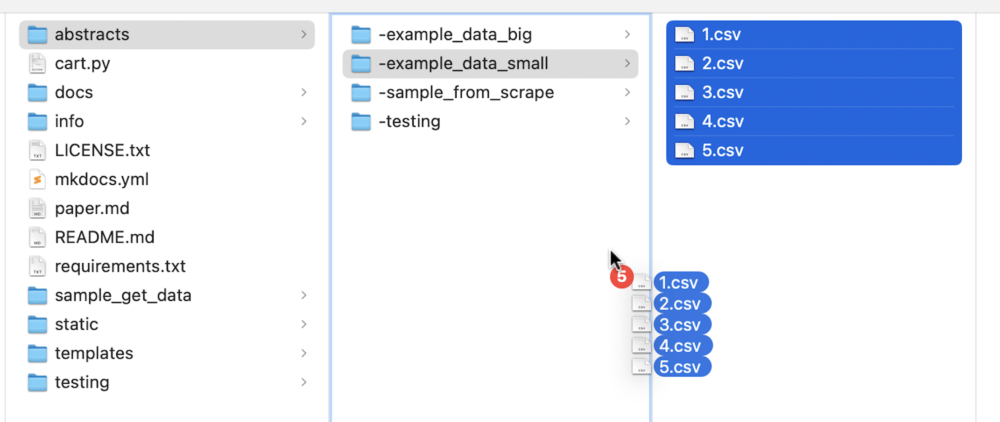
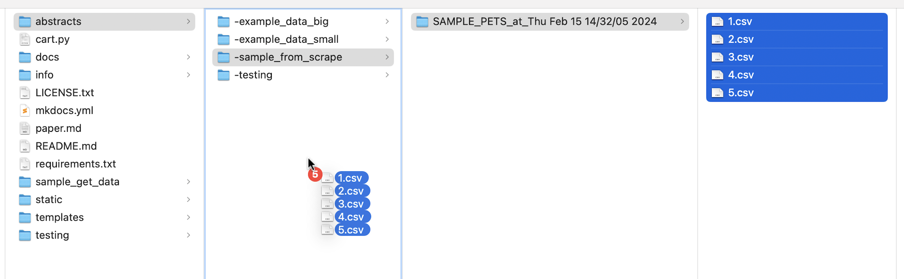

# Assumptions

`CART` makes a few assumptions about the world. 

### Assumption #1: Abstracts exist

`CART` assumes both that a folder of "abstracts" exists, and that within this folder are csv files with the following headings: `unique_id`,`review_count`,`url`,`title`,`abstract`,`user`,`vote`,`in_progress`,`time`. 

These columns adhere to the following properties:

| column       | object type            | default value      | comment                                                      |
| ------------ | ---------------------- | ------------------ | ------------------------------------------------------------ |
| unique_id    | int (in csv as string) | user supplied      | keeps track of each paper                                    |
| review_count | int (in csv as string) | 0                  | count of number of votes cast on this paper                  |
| url          | string                 | user supplied      | hyperlink for paper                                          |
| title        | string                 | user supplied      | paper title (HTML permissible)                               |
| abstract     | string                 | user supplied      | paper abstract (HTML permissible) required to end with "------endofabstract------xxxx" where the xxxx is the unique_id of the paper |
| user         | string                 | none               | team member acting on entry                                  |
| vote         | string                 | none               | what team member's vote is                                   |
| in_progress  | string                 | no                 | flag for team member opening abstract                        |
| time         | string                 | 1707541131.0723252 | helpful when viewing latest actions                          |

For example, the paper titled `6583.csv` would be a file that looks like this:


```
unique_id,review_count,url,title,abstract,user,vote,in_progress,time
6583,
0,
https://www.usenix.org/conference/usenixsecurity20/presentation/wei,
"What Twitter Knows...",
"Although targeted advertising...------endofabstract------6583",
none,
none,
no,
1691766446.157932

```


#### Getting Papers: A DEMO

If you would like to see how populating the abstracts folder could look, you have a few options. The first option is copy some of the example files into the abstracts folder. 



The second option is to run the demo scraper `get_data.py` located in the `sample_get_data` folder. If you run this file, you will be scraping paper titles and abstracts from the Privacy Enhancing Technologies Symposium for the year 2023. This script will create a new folder `/abstracts/-sample_from_scrape/SAMPLE_PETS_at_<TIME GOES HERE>/'`which will house the .csv files (numbered) that `CART` expects to see. You can then drag and drop these files to the `abstracts/` location and try them out. Researchers may choose to expand this scraping script to include more years and conferences when creating an initial batch of papers to review. 




### Assumption #2: Member-Driven-Server-Is-OK

The second assumption made by `CART` is that one team member keeps `cart.py` running on their local machine for as long as the culling process takes. Although it is true that a viable alternative would be to point a server at `CART`, this depends on resources that are not typically freely accessible. Therefore, `CART` makes every effort possible to provide teams with a "zero-step" culling process. One team member initiates `CART` with the free `ngrok` service, allowing everyone to view and grade papers at their leisure. 


### Assumption #3: Users are friendly	

`CART` assumes (to use security terminology) that users are friendly, but curious. There is no strict login process because it is assumed that users are not going to be logging in with other usernames and making fraudulent votes. This is also helpful when an administrator needs to review votes cast by other members or debug (logging in as the other user helps reproduce the issue). 
