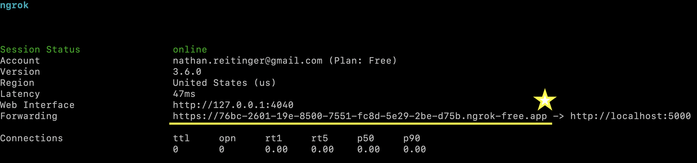
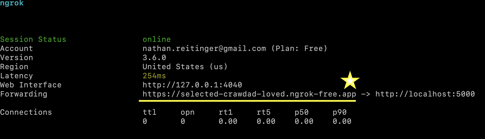

# Quick Setup

The following instructions need only be accomplished by the team member running the server. 


## Install 

```
git clone https://github.com/nathanReitinger/CART
cd CART
```


## Requirements 

> conda (tested with **conda 23.1.0**)

#### Anaconda3

```bash
conda env create -f cart.yml
```


> pip (tested with **Python 3.10.0**)

#### Ubuntu

```bash
sudo apt-get update
sudo apt install python3-pip
sudo pip3 install -r requirements.txt
```

#### Windows

```bash
==> Search for python3.n in Microsoft store
sudo pip3 install -r requirements.txt
```

#### MacOS

```bash
==> assume python3 is installed: brew install python3
sudo pip3 install -r requirements.txt
```


## `ngrok` 

> !!! WARNING
>
>`ngrok` is not required to run `CART` but is strongly recommended because it allows one team member to set up a server that can be accessible by any other team member (as opposed to localhost).


- Sign up: [https://dashboard.ngrok.com/signup](https://dashboard.ngrok.com/signup)
- Get auth token: [https://dashboard.ngrok.com/get-started/your-authtoken](https://dashboard.ngrok.com/get-started/your-authtoken) 
- Get static page: [free ngrok static domain](https://ngrok.com/blog-post/free-static-domains-ngrok-users#:~:text=Static%20domains%20are%20unique%20domains,links%20caused%20by%20agent%20restarts.)

*OPTIONAL* you can use your own server&#151;but in the spirit of free and open-source software, we assume a private server is not available. 


## Getting Started 

> !!! Note
>
>
> `CART` will assume that papers are represented as .csv files and that these files are found in the `abstracts/` folder.


- For quick setup, it is easiest to use the example abstracts. Copy the contents of `-example_data_big` or `-example_data_small` into the abstracts folder. The file structure should look like this:

```
.
├── abstracts
│   │   1.csv // your abstracts go here
│   │   2.csv // your abstracts go here
│   │   ...
│   └── ngrok_auth.txt
```

- the `ngrok_auth.txt` file stores your authToken if you are using the `ngrok` flag. 

---

---

---


#### localhost (*testing or development*)

##### EXAMPLE 1

Start `CART` on localhost by passing in each team member `-c user1` and use default flags 

```bash
python3 cart.py -c user1 -c user2
```

- two coders (user1-2)
- defaults for all other flags 
  - e.g., two reviews will be required per abstract
- point your browser to the localhost address posted in the terminal, there you will find the login screen of the app. 


```bash
 * Serving Flask app 'cart'
 * Debug mode: on
WARNING: This is a development server. Do not use it in a production deployment. Use a production WSGI server instead.
 * Running on all addresses (0.0.0.0)
 * Running on http://127.0.0.1:8081 <==================== address you want ***
 * Running on http://192.168.0.191:8081
Press CTRL+C to quit
 * Restarting with watchdog (fsevents)

#
#
# ,-. ,-. ,-. |- 
# |   ,-| |   |  
# `-' `-^ '   `' 
#
#

 * Debugger is active!
 * Debugger PIN: 760-158-545
```


##### EXAMPLE 2

Start `CART` on localhost by passing in team members, the port, and a confetti flag

```bash
python3 cart.py -c user1 -c user2 -p 8081 -cf 30
```

- two coders (user1-2)
- port set to 8081
  - if the OS finds that the port is being used, `CART` will exit (specify a new port or close the port in use)
- confetti spray set to 30 


```bash
 * Serving Flask app 'cart'
 * Debug mode: on
WARNING: This is a development server. Do not use it in a production deployment. Use a production WSGI server instead.
 * Running on all addresses (0.0.0.0)
 * Running on http://127.0.0.1:8081  <==================== address you want ***
 * Running on http://192.168.0.191:8081
Press CTRL+C to quit
 * Restarting with watchdog (fsevents)

#
#
# ,-. ,-. ,-. |- 
# |   ,-| |   |  
# `-' `-^ '   `' 
#
#

 * Debugger is active!
 * Debugger PIN: 760-158-545
```


---

---

---


#### `ngrok`  (*teamwork*)

##### EXAMPLE 1

```bash
python3 cart.py -c user1 -c user2 -c user3 -n 1l9nyS6lXovar....LECyV -cf 20
```

- three coders (user1-3)
- `ngrok` authToken "1l9nyS6lXovar....LECyV"
- confetti on every 20th vote submitted by a team member 
- this will produce a random URL on each run of `CART`




> !!! Notification
>
>
> The following option allows team members to connect to the same domain each time, and `ngrok` offers static domains for free. 


##### EXAMPLE 2

```bash
python3 cart.py -c user1 -c user2 -c user3 -d selected-crawdad-loved.ngrok-free.app -n 1l9nyS6lXovar....LECyV -cf 20
```

- three coders (user1-3)
- `ngrok` authToken "1l9nyS6lXovar....LECyV"
- `ngrok` static domain `selected-crawdad-loved.ngrok-free.app` (use your own)
- confetti on every 20th vote submitted by a team member 
- this will use the static URL for successive runs! 



