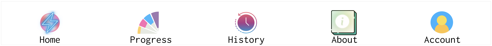

# Summary

`CART` (Culling Abstacts for Relevancy in Teams) provides a way for a team of individuals to complete the first step common to most SoK projects[^1]: culling, in teams, a large set of research papers (i.e., titles and abstracts) based on per-project relevancy criteria. Existing software solutions either do not fit this need in a usable way—leading to error-prone voting—or do not offer the necessary functionality to work on this problem effectively.

`CART` provides both functionaity and usability: *Functionally*, `CART` accommodates teams of any size (i.e., accommodating race conditions), review requirements of any number (e.g., madating that each paper is reviewed by *n* team members), and dynamic participation rates (e.g., team members may participate in as little or as much reviewing as they like). *Usability-wise*, `CART` provides a gamified user interface, making the process of reviewing papers easier and therefore more accurate and more efficient. 

# Statement of need

A systematization of knowledge or systematic review paper is a popular class of paper found across multiple disciplines: medicine, computer science, sociology, psychology, economics, political science, marketing,  and genetics. This type of paper most commonly involves a two-stage process. In the first stage, researchers gather a large set of papers—easily over 10,000—and then manually filter those papers (based on paper titles and abstracts) according to predefined relevancy criteria [@thomas:2021; @singhal:2023; @franz:2021; @reitinger:sok]. For example, if a researcher wanted to learn about legally-sufficient data sanitization tools [@bellovin:2019], a paper on the prevalence of a particular web tracking technique like canvas fingerprinting [@reitinger:2021] would be marked as irrelevant, but a paper on statutory differentially privacy requirements [@reitinger:2023] would be marked as relevant. After this first step is complete—often resulting in a set of around 100 papers—most researchers move on to analyzing papers in-depth, using qualitative coding techniques well-fit by existing software.

Surprisingly, software to support this first step of paper culling is currently lacking. Existing tools are either too generalist (resulting in ineffective paper reviewing) or too fine-tuned (resulting in tradeoffs impacting functionality). For example, generalist tools like Microsoft Excel or Google Sheets could allow teams of researchers to check the relevancy of snippets of text, but these tools can be clunky (i.e., given the scale of papers in consideration) and not usable (i.e., reviewing hundreds of rows in a spreadsheet is error-prone and fatiguing). Other tools, like Atlas.ti [@smit:2021] or maxQDA [@Franzosi:2012], could allow teams of researchers to "code" for relevancy, but do not naturally accommodate dynamic participation (e.g., team members might not be able to review the same amount of papers) or variable review rates (e.g., sometimes you want all team members to review all papers, and sometimes you want at least two, but you do not set who those team members are). 

# `CART`

`CART` provides a way for teams to accomplish the goal of culling a large set of research papers. Team members may contribute as little or as much as they want, the experience of reviewing papers is gamified, and `CART` prioritizes protection against data loss, error, and data corruption. Most importantly, `CART` is fully functional without requiring server space (although this is certainly possible with an appropriately provisioned environment) and easily tunable for a project's specific needs. 

`CART` utilizes Flask, ngrok, and a web interface to allow one team member to create a server that other team members can access. As shown in \autoref{fig:arch}, `CART` has two primary functions. 

*First*, `CART` runs a Flask application responsible for serving and updating papers (i.e., represented as an abstract, title, URL, and a few metadata fields). A team member will only be served an abstract that they have not seen before, needs votes, has not been flagged as "not" a research paper (i.e., a proceedings or similar document), and is not being viewed by another user. After a vote is cast, the Flask application will update the paper to log who voted, what their vote was, and how many votes have been cast for the paper. This process of serving and updating papers will loop until there are no more eligible papers available. 

*Second*, `CART` creates a gamified user experience for reviewing papers. The web interface makes voting on a paper simple (i.e., button click or keyboard press), allows users to set personal goals, and rewards (with confetti) users on every 50th (or set by the team) vote submitted. The web interface also includes tabs (\autoref{fig:tabs}) for **voting** on papers (home), viewing the team's **progress** (bar chart, total vote counts), viewing personal voting **history** (last 50 edits, permitting a change-of-vote), logging information **about** the project (collaborative editing with backups, where users may write guidelines for voting), and viewing **account** details (logging in and out). Moreover, the web app is optimized to provide information in a timely fashion (e.g., storing 'open' papers in logs rather than reviewing the full corpus of possible papers to find open papers). 

# References

[^1]: These projects are also called systematic review projects. 
